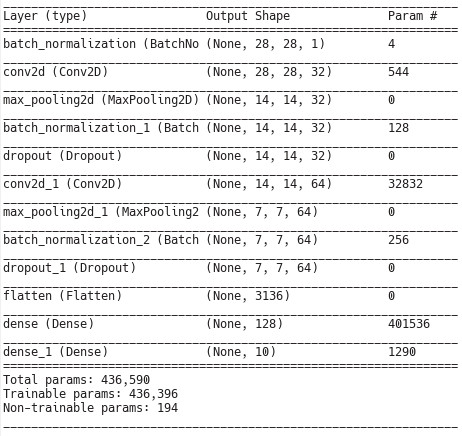
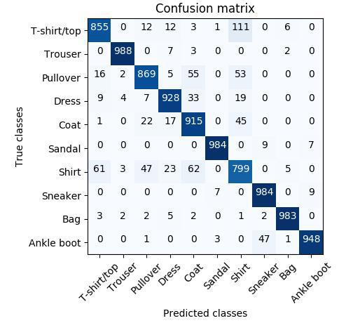

# Image CNN classifier trained on fashion-MNIST.
This is my first neural network. My goal was to create CNN, learn how works convolution neural networks, how batch normalization and dropout layers improve model results and learn Keras and Tensorflow frameworks. As train data, I chose the [fashion-MNIST](https://github.com/zalandoresearch/fashion-mnist) dataset and model reaches 92.53% accuracy on average. You can find further information about the dataset on [Zalando Research](https://github.com/zalandoresearch/fashion-mnist) and [Kaggle](https://www.kaggle.com/zalando-research/fashionmnist)

## Training and evaluation
I split the training data on a train(75%) and validation(25%) samples. The test set of 10,000 images are used for final evaluation.

## Model
I was trying to create a very simple architecture with less than 500,000 parameters. The model has 2 blocks of convolution, max polling, batch normalization and dropout layers. Last block connected to dense layers. This is the summary of the model:

This model can't reach accuracy more than 92% because it is difficult to distinguish between T-shirt/Top and Shirt classes. And as we can see in the confusion matrix, most mismatches model makes on these two classes.

## Results

Scores for training: 0.1263 loss / 95.12% accuracy. 
Scores for validation: 0.1834 loss / 94.24% accuracy. 
Scores for test: 0.2657 loss / 92.53% accuracy.

If you are interested in further results, you can find them on [Zalando benchmark](https://github.com/zalandoresearch/fashion-mnist#benchmark).

## References
[1] [Fashion-MNIST](https://github.com/zalandoresearch/fashion-mnist) 
[2] [Fashion-MNIST: a Novel Image Dataset for Benchmarking Machine Learning Algorithms](https://arxiv.org/abs/1708.07747)
